 

 

## About

I'm a developer focused on building clean, efficient software and digging into algorithms, data structures, and low-level engineering. I like solving complex puzzles — whether that's optimizing code, structuring data, or getting hardware and software to talk to each other.

| | |
|---|---|
| **Building** | Sleek portfolio layouts and hobby electronics |
| **Exploring** | Embedded systems, interactive UI design |
| **Off duty** | Watching F1 |

 

## Stack

| Category | |
|---|---|
| **Languages** | `C` `C++` `Python` `JavaScript` `SQL` `HTML/CSS` |
| **Frameworks** | `React` `Node.js` `Next.js` `PostgreSQL` |

 

## Stats

 

## Projects

| Project | Description | Stack |
|---|---|---|
| **[Portfolio Website](https://github.com/SimpleMindedMoron/SimpleMindedMoron.github.io)** | Responsive developer portfolio with a modern, card-based layout, built with CSS Flexbox/Grid and tuned for clean navigation | `React` `Node.js` `Vanilla CSS` |
| **[Embedded Systems / IoT](https://github.com/SimpleMindedMoron/iisc-final-project-automated-car)** | Hobby electronics on ESP32 and Arduino, focused on hardware-software interfacing, sensor integration, and power management | `ESP32` `Arduino` `Embedded C` `Python` `ROS2 Jazzy` |

 

Arjun Sanesh

